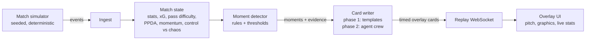

# Virtual Studio Crew

**An AI production crew for football broadcasts.** Synthetic match events go in. Explainable,
timed, personalised insight graphics come out, ready to sit on screen alongside the match.

Built for the *Synthetic Match Insights Engine for Premier League Studio* hackathon challenge.
All clubs, players and match data are synthetic. No real match data is used.

> **Status: phase 1 of 4 (foundations).** The simulator, metrics engine, moment detection,
> template cards, live replay API and overlay UI work end to end. The Azure AI agent crew
> lands in phase 2. See the [roadmap](#roadmap).

## How it works



The design rule is that **numbers come from code and words come from AI.** Every stat is
computed by the engine. Every moment carries the facts behind it and the ids of the events
that led to it. The writing layer explains those facts; it is never asked to invent them.

| Brief stage | Where it lives |
|---|---|
| Ingest | `MatchSimulator` emits events; `ReplayStreamer` plays them in scaled real time |
| Interpret | `MatchState`: team, player and rolling live metrics |
| Explain | `MomentDetector` decides *that* a moment matters and attaches the evidence; the agent crew (phase 2) explains *why* |
| Render | `InsightCard`: slot, priority, show time and duration, so a graphics engine can schedule it without parsing prose |
| Personalise | Phase 3: persona and language agents rewrite each card per viewer |

## Metrics

All metrics are pure functions in [`Pitch.cs`](backend/src/Studio.Engine/Pitch.cs) and
[`MatchState.cs`](backend/src/Studio.Engine/MatchState.cs). The simulator uses the same
functions to decide outcomes, so a pass rated difficult really was less likely to succeed.

| Metric | Definition |
|---|---|
| Pass difficulty (0–1) | 0.05 + 0.40·length + 0.20·forward progress + 0.20·target zone + 0.15·under pressure |
| xG | Logistic on goal-mouth angle and distance, minus penalties for pressure and headers. About 0.25 from the penalty spot |
| Ball / shot speed | km/h, supplied per event as a tracking system would |
| Player speed and sprint distance | Sprint events; a speed tag fires at 32 km/h or more |
| PPDA | Opponent passes in their own 60% ÷ our tackles, interceptions, fouls and recoveries there. Lower = more intense press |
| Momentum (−100…+100) | Last 5 min: 40% xG share, 30% final-third entries, 30% possession |
| Control (0–100) | Last 5 min: possession share, pass accuracy, passes per possession |
| Chaos (0–100) | Last 5 min: turnovers per minute, share of actions under pressure, fouls |

Across 20 simulated matches a team averages about 1.5 goals, 10 shots, 570 passes and 81%
pass accuracy. A test keeps those averages in a realistic range.

## Synthetic data

`MatchSimulator` builds a full 90-minute match from one integer seed: kick-offs, passes,
carries, shots, tackles, interceptions, pressure, fouls, possession changes, sprints,
substitutions and stoppage time. Team styles change during the match (one side switches to a
high press after the hour, fatigue sets in, trailing teams go direct) so there are real stories
for the engine to find from the data alone.

A sample match is committed at [`data/sample/seed-7`](data/sample/seed-7): `match.json`
holds the metadata and squads, and `events.jsonl` has one event per line. A test fails if the
sample drifts from the generator.

## Run it

Requirements: .NET 9 SDK and Node 20+.

```bash
cd backend && dotnet run --project src/Studio.Api --launch-profile http
```

```bash
cd frontend && npm install && npm run dev
```

Open http://localhost:5173, pick a seed and press **Kick off**.

Other entry points:

```bash
cd backend && dotnet test
```

```bash
cd backend && dotnet run --project src/Studio.Cli -- moments --seed 7
```

The CLI also has `summary` (full-time stats as JSON) and `generate --seed N --out DIR` (write a dataset).

## API

| Endpoint | Returns |
|---|---|
| `GET /api/health` | Liveness |
| `GET /api/matches/{seed}` | Match metadata and squads |
| `GET /api/matches/{seed}/events` | Every event |
| `GET /api/matches/{seed}/summary` | Full-time stats, all moments and all cards |
| `WS /ws/replay?seed=7&speed=20` | Live stream of `info`, `event`, `snapshot`, `moment`, `card` and `end` envelopes |

JSON is camelCase with snake_case enum values.

## Repository layout

```
backend/
  src/Studio.Engine   simulator, metrics, match state, moments, cards (no web dependencies)
  src/Studio.Api      ASP.NET Core minimal API + replay WebSocket
  src/Studio.Cli      dataset generation and inspection
  tests/Studio.Tests  xUnit: metrics, simulator realism, moments, API, dataset drift
frontend/             React + TypeScript + Vite overlay UI
data/sample/          committed synthetic dataset
```

## Roadmap

| Dates (2026) | Phase |
|---|---|
| 7–10 Oct | **1. Foundations:** simulator, metrics, moments, replay API, overlay UI, CI ✅ |
| 11–15 Oct | **2. Agent crew** on Azure AI Foundry with Microsoft Agent Framework: Analyst, Tactician, Fact-Checker, Producer |
| 16–19 Oct | **3. Fan experience:** persona panes side by side, "Why did that happen?", Localiser agent |
| 20–22 Oct | **4. Recap and deployment:** spoken bilingual recap (Azure AI Speech), Container Apps + Static Web Apps |
| 23–26 Oct | Demo video, pitch, submission |

## License

MIT © 2026 Timilehin Owolabi
