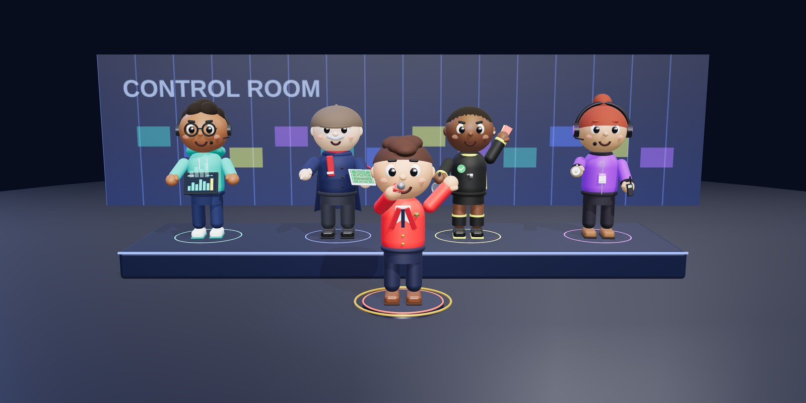
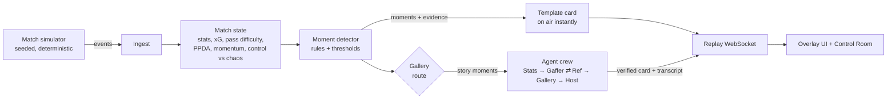
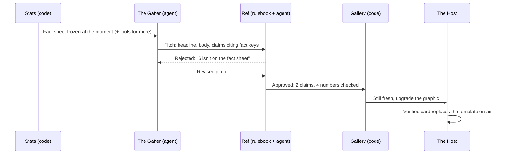

# Virtual Studio Crew



**An AI production crew for football broadcasts.** Synthetic match events go in. Explainable,
timed, personalised insight graphics come out, ready to sit on screen alongside the match.

Built for the *Synthetic Match Insights Engine for Premier League Studio* hackathon challenge.
All clubs, players and match data are synthetic. No real match data is used.

> **Status: phase 3 of 4 (fan experience).** The pipeline, the five-agent crew and personalised
> fan views run end to end with an offline scripted model. The Azure OpenAI path is built and
> switches on through configuration; it hasn't yet been run against a live deployment. See the
> [roadmap](#roadmap).

## The crew

Five AI agents, each played by an original character with one job.

| Character | Role | Job |
|---|---|---|
| **Stats** | Data Analyst | Pulls the numbers from the engine. Never gives an opinion |
| **The Gaffer** | Tactician | Pitches the story behind the numbers |
| **Ref** | Fact-Checker | Rejects any claim the evidence doesn't support |
| **Gallery** | Producer | Decides what goes on air, when, and what gets dropped |
| **The Host** | Presenter | Tells each fan the story their way, in their language |

Characters designed and modelled by Timilehin Owolabi. Avatars, turnaround sheets and prop
textures are in [`frontend/public/crew`](frontend/public/crew).

## How it works



### Inside the crew



- **Stats** is code, not a model. It freezes a fact sheet the instant the moment happens and
  exposes `get_player_stats` and `get_pressing` as tools. Anything a tool returns is written to
  the sheet first, so it can be checked too.
- **The Gaffer** is a Microsoft Agent Framework `ChatClientAgent` with its own session per
  moment, so revisions keep the conversation.
- **Ref** runs a rulebook first: every number must be on the sheet at the precision quoted,
  counts must be exact, every claim must cite real fact keys, and no season, record or certainty
  claims. Only then does a second agent judge whether the claims follow from the facts.
- **Gallery** routes moments (speed tags go straight to air), caps how many the crew works on
  at once, and drops verified stories that arrive after play has moved on.
- **The Host** writes each verified story again for every viewer: their persona, their club or
  player, their language. Ref re-checks every version in every language (decimal commas
  included); a version that fails falls back to that viewer's translated template.

The template card always airs first, so the crew never slows the broadcast down. If the model
is slow or unavailable, viewers still get the template.

The design rule is that **numbers come from code and words come from AI.** Every stat is
computed by the engine. Every moment carries the facts behind it and the ids of the events
that led to it. The writing layer explains those facts; it is never asked to invent them.

| Brief stage | Where it lives |
|---|---|
| Ingest | `MatchSimulator` emits events; `ReplayStreamer` plays them in scaled real time |
| Interpret | `MatchState`: team, player and rolling live metrics |
| Explain | `MomentDetector` decides *that* a moment matters and attaches the evidence; the agent crew explains *why*, and Ref verifies it |
| Render | `InsightCard`: slot, priority, show time and duration, so a graphics engine can schedule it without parsing prose |
| Personalise | `Relevance` decides what each viewer sees; `HostAgent` rewrites each verified story per viewer and language |

## Made for every fan

The **Fan View** shows the same match to up to four viewers side by side. Each viewer is a
profile: a persona, a language (English, Spanish or French), and optionally a club or player.

| Persona | Sees | Sounds like |
|---|---|---|
| Analyst | Every story | Numbers and named metrics: xG, PPDA, control index |
| Casual fan | Goals, big chances, momentum swings, speed tags | Plain words, at most one number |
| Club fan | Their club's stories, plus the goals and chances against them | "We" and "us", honest when it goes wrong |
| Player focus | Their player's moments and every goal, with a live stat strip | Centred on the player, using their numbers |

Personalisation is also about what a viewer does *not* see: `Relevance` is plain code, so every
choice is predictable. Translated template graphics air instantly, so nobody waits in English
for the crew.

**Why did that happen?** Every story has a replay. It steps through the events that led to the
moment on a pitch, captioning each one from the event data, then shows the verified story. Each
step and each word traces back to evidence.

**Animated crew.** Avatars play a character clip for the state they're in (Ref raising the red
card when a pitch is sent back, The Host on air) as soon as the clip is listed in
[`frontend/public/crew/clips/manifest.json`](frontend/public/crew/clips/manifest.json). Until
then they show the still portrait.

## Metrics

All metrics are pure functions in [`Pitch.cs`](backend/src/Studio.Engine/Pitch.cs) and
[`MatchState.cs`](backend/src/Studio.Engine/MatchState.cs). The simulator uses the same
functions to decide outcomes, so a pass rated difficult really was less likely to succeed.

| Metric | Definition |
|---|---|
| Pass difficulty (0–1) | 0.05 + 0.40·length + 0.20·forward progress + 0.20·target zone + 0.15·under pressure |
| xG | Logistic on goal-mouth angle and distance, minus penalties for pressure and headers. About 0.25 from the penalty spot |
| Ball / shot speed | km/h, supplied per event as a tracking system would |
| Player speed and sprint distance | Sprint events; a speed tag fires at 32 km/h or more |
| PPDA | Opponent passes in their own 60% ÷ our tackles, interceptions, fouls and recoveries there. Lower = more intense press |
| Momentum (−100…+100) | Last 5 min: 40% xG share, 30% final-third entries, 30% possession |
| Control (0–100) | Last 5 min: possession share, pass accuracy, passes per possession |
| Chaos (0–100) | Last 5 min: turnovers per minute, share of actions under pressure, fouls |

Across 20 simulated matches a team averages about 1.5 goals, 10 shots, 570 passes and 81%
pass accuracy. A test keeps those averages in a realistic range.

## Synthetic data

`MatchSimulator` builds a full 90-minute match from one integer seed: kick-offs, passes,
carries, shots, tackles, interceptions, pressure, fouls, possession changes, sprints,
substitutions and stoppage time. Team styles change during the match (one side switches to a
high press after the hour, fatigue sets in, trailing teams go direct) so there are real stories
for the engine to find from the data alone.

A sample match is committed at [`data/sample/seed-7`](data/sample/seed-7): `match.json`
holds the metadata and squads, and `events.jsonl` has one event per line. A test fails if the
sample drifts from the generator.

## Run it

Requirements: .NET 9 SDK and Node 20+.

```bash
cd backend && dotnet run --project src/Studio.Api --launch-profile http
```

```bash
cd frontend && npm install && npm run dev
```

Open http://localhost:5173, pick a seed and press **Kick off**.

Other entry points:

```bash
cd backend && dotnet test
```

```bash
cd backend && dotnet run --project src/Studio.Cli -- moments --seed 7
```

The CLI also has `summary` (full-time stats as JSON), `crew` (the Control Room transcript for a
match) and `generate --seed N --out DIR` (write a dataset).

### Running the crew on Azure OpenAI

By default the crew uses `ScriptedChatClient`, an offline stand-in that writes in each
character's voice from the fact sheet. To show the review loop, it overreaches on about one
moment in three and backs down when Ref objects. To use a real model, deploy one in Azure AI
Foundry (for example `gpt-4.1-mini`) and set:

```bash
cd backend/src/Studio.Api && dotnet user-secrets set "Crew:Mode" "azure"
```

```bash
cd backend/src/Studio.Api && dotnet user-secrets set "Crew:Endpoint" "https://<your-resource>.openai.azure.com/"
```

```bash
cd backend/src/Studio.Api && dotnet user-secrets set "Crew:Deployment" "gpt-4.1-mini"
```

Leave `Crew:ApiKey` unset to sign in with Microsoft Entra ID (`az login` locally, managed
identity in Azure), or set it to use a key. `GET /api/health` reports which model is active.

## API

| Endpoint | Returns |
|---|---|
| `GET /api/health` | Liveness |
| `GET /api/matches/{seed}` | Match metadata and squads |
| `GET /api/matches/{seed}/events` | Every event |
| `GET /api/matches/{seed}/summary` | Full-time stats, all moments and all cards |
| `WS /ws/replay?seed=7&speed=20` | Live stream of `info`, `event`, `snapshot`, `moment`, `card`, `crew` and `end` envelopes. Add `crew=off` for template cards only, and `viewers=analyst.en,casual.es,club.fr.home,player.en.H10` for personalised versions |

JSON is camelCase with snake_case enum values.

## Repository layout

```
backend/
  src/Studio.Engine   simulator, metrics, match state, moments, cards (no web dependencies)
  src/Studio.Crew     the five-agent crew on Microsoft Agent Framework, plus the offline model
  src/Studio.Api      ASP.NET Core minimal API + replay WebSocket
  src/Studio.Cli      dataset generation and inspection
  tests/Studio.Tests  xUnit: metrics, simulator realism, moments, Ref's rulebook, crew loop, personas, languages, API, dataset drift
frontend/             React + TypeScript + Vite overlay UI
data/sample/          committed synthetic dataset
```

## Roadmap

| Dates (2026) | Phase |
|---|---|
| 7–10 Oct | **1. Foundations:** simulator, metrics, moments, replay API, overlay UI, CI ✅ |
| 11–15 Oct | **2. Agent crew** on Microsoft Agent Framework: Stats, The Gaffer, Ref, Gallery, The Host, plus the Control Room ✅ (live Azure run pending) |
| 16–19 Oct | **3. Fan experience:** persona panes side by side, "Why did that happen?", The Host in three languages ✅ |
| 20–22 Oct | **4. Recap and deployment:** spoken bilingual recap (Azure AI Speech), Container Apps + Static Web Apps |
| 23–26 Oct | Demo video, pitch, submission |

## License

MIT © 2026 Timilehin Owolabi
